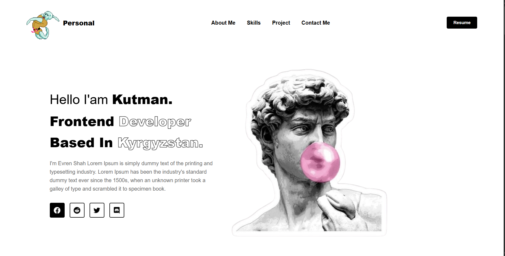

# 💼 Personal Portfolio — Kutman | Frontend Developer

Современный адаптивный портфолио-сайт фронтенд разработчика, созданный на HTML и CSS.

Проект демонстрирует навыки верстки, структуру реального портфолио и продуманную архитектуру секций.

## 🌍 О проекте

Это персональный моего сайт-портфолио, включающий:

Главный экран (Hero Section)

Навигацию

Блок навыков

Опыт работы

О себе

Проекты

Отзывы

Контактную форму

Футер

Сайт оформлен в современном минималистичном стиле с акцентом на персональный бренд.

## ⚙️ Используемые технологии

HTML5

CSS3

Flexbox

Grid Layout

Адаптивная верстка

[Посмотреть DEMO версию](https://reliable-biscotti-bf3b64.netlify.app/)
